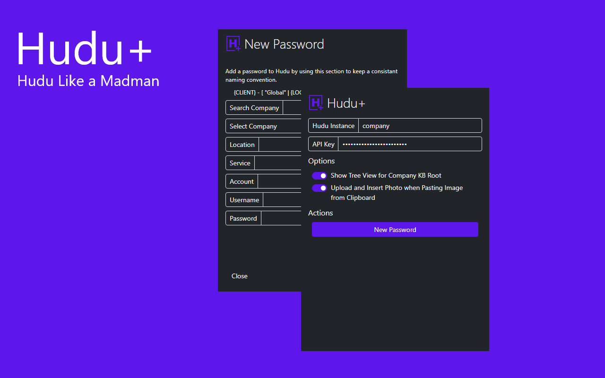
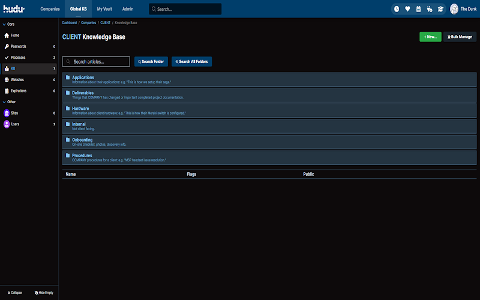
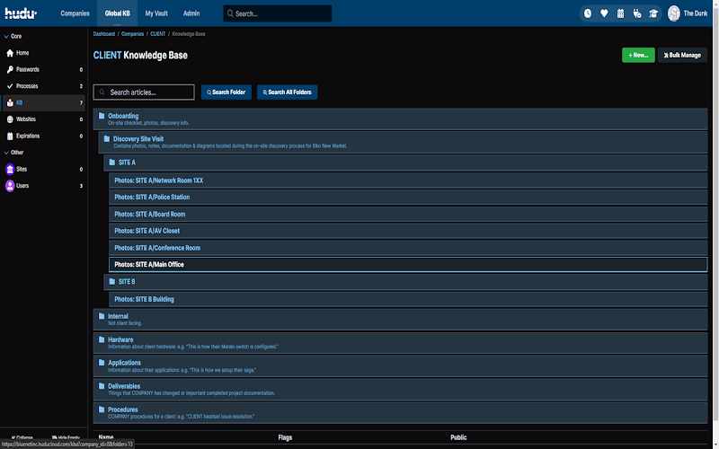
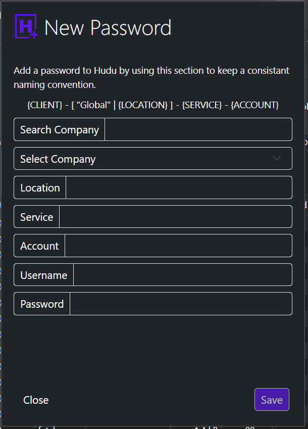

# Hudu+
_Hudu like a madman_

Check it out on the [Extension Store](https://chromewebstore.google.com/u/1/detail/hudu+/ephjgpphegbbhipfbncfgicnnkidighi?hl=en)!

## Disclaimer

_This project is NOT affiliated with Hudu.  Use at your own risk._

## Installation Instructions

### Google Chrome / Microsoft Edge

* Download this repo
* In Chrome/Edge go to the extensions page (chrome://extensions or edge://extensions).
* Enable Developer Mode.
* Press the `Load Unpacked` button
* From the previously downloaded folder, select the `src` folder
* Create a [Hudu API Key](https://support.hudu.com/hc/en-us/articles/11422780787735-REST-API) and apply it within the extension. Please note you will need the password access checked if you wish to use the password naming convention helper.

_NOTE Once the extension is loaded, you cannot delete the folder_

### Firefox

_Not yet supported_

## Previews

### Extension Preview

### Feature: Hudu Company KB Tree View

### Feature: Hudu Password Naming Convention Helper

